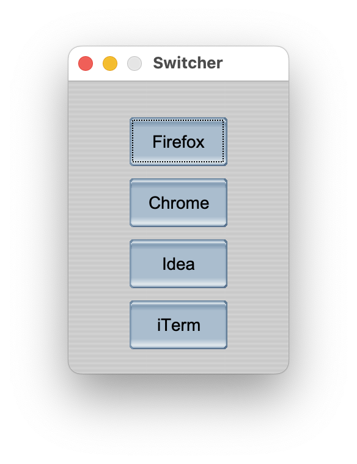

# Switcher

Mouse driven application switcher for Mac.

Right click twice to show a menu with set applications to switch between.

Configure which apps you want to show in assets/config.csv

## Running the releases

Since the release .app bundles are unsigned macOS will warn that the app is damaged when opened.

To remedy this, run the terminal command below:
```
xattr -d com.apple.quarantine Switcher.app
```


